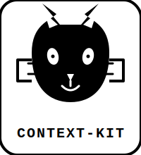
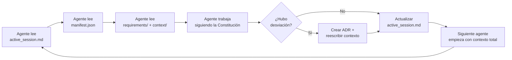

<div align="center">
  
  <br/>
  <strong>Estructura .ai/ para darle superpoderes de contexto a los agentes de IA</strong>
  <br/>
  <a href="#instalación"></a>
  <a href="LICENSE"></a>
</div>

---

## 🤔 ¿Qué problema resuelve?

Los agentes de IA (Copilot, Cursor, Claude Code, etc.) son **tan buenos como el contexto que reciben**. Normalmente pierdes los primeros 10-15 minutos de cada sesión explicando el stack, las reglas del proyecto, qué se hizo antes y dónde tocar.

**Context Kit** instala una carpeta `.ai/` en la raíz de tu proyecto que actúa como **memoria externa estructurada**. Cualquier agente que la lea entiende al instante:

- 🏗️ **Cómo ejecutar comandos** (sin reinventar entornos virtuales)
- 📋 **Qué se está construyendo ahora** (sesión activa)
- 🧠 **Reglas de negocio sagradas** (contexto de dominio)
- 📜 **La constitución del proyecto** (cómo debe comportarse la IA)
- 📝 **Decisiones técnicas pasadas** (ADRs)

---

## 📦 Instalación

```bash
npm install -g context-kit
```

O úsalo directamente con `npx`:

```bash
npx context-kit
```

Esto crea la carpeta `.ai/` en el directorio actual con toda la estructura lista para rellenar.

Si ya tienes una carpeta `.ai/` y quieres regenerarla desde cero:

```bash
npx context-kit --force
```

---

## 📁 Estructura generada

```
.ai/
├── 00_CONSTITUTION.md          ← Reglas inmutables para la IA
├── manifest.json               ← Stack, comandos, entornos
├── context/
│   ├── business/               ← Reglas de negocio, invariantes, modelos de dominio
│   ├── data/                   ← Esquemas, migraciones, relaciones de BBDD
│   └── technical/              ← Arquitectura, stacks, patrones, dependencias
├── requirements/
│   ├── active/                 ← Historias de usuario y features EN DESARROLLO
│   └── backlog/                ← Features priorizadas para el futuro
├── state/
│   ├── active_session.md       ← ¿Qué se hizo? ¿Qué toca ahora?
│   ├── backlog.md              ← Deuda técnica y bugs conocidos
│   └── decisions/              ← ADRs (Architecture Decision Records)
└── templates/
    ├── adr_template.md         ← Plantilla para documentar decisiones técnicas
    └── new_feature_template.md ← Plantilla para nuevas features
```

---

## 🧭 La Constitución (00_CONSTITUTION.md)

Es el **contrato de comportamiento** entre el equipo humano y los agentes de IA. Define 5 reglas en cascada que todo agente debe seguir:

| Regla | Nombre | Descripción |
|-------|--------|-------------|
| **Regla 0** | La Ley del Manifest | Usar **siempre** los comandos y entornos definidos en `manifest.json`. Nunca inventar `python` si el manifest dice `uv run python`. |
| **Regla 1** | El Aquí y Ahora | Leer `state/active_session.md` antes de empezar cualquier tarea. Saber qué se hizo y qué toca. |
| **Regla 2** | Doble Naturaleza | Distinguir `requirements/` (el QUÉ quiere el cliente) de `context/business/` (el CÓMO técnico inviolable). Si entran en conflicto, gana el contexto de negocio y se documenta con un ADR. |
| **Regla 3** | Protocolo de Divergencia | Si la implementación se desvía del diseño original, crear un ADR en `state/decisions/` y **reescribir** (no parchear) el archivo de contexto afectado. |
| **Regla 4** | Cierre de Sesión | Al terminar, actualizar `state/active_session.md` para que el siguiente agente (o tú mismo mañana) se ponga al día en 10 segundos. |

---

## 📋 El Manifest (manifest.json)

Es el **"entorno de ejecución declarado"**. Contiene:

- **`runtimes`** — Qué lenguajes están disponibles, qué versiones, y con qué gestor se ejecutan (`uv`, `fnm`, `nvm`...)
- **`command_aliases`** — Mapeo de comandos prohibidos → permitidos. Ej: `"python": "uv run python"`, `"npm": "bun"`
- **`servers`** — URLs locales, puertos, comandos de reinicio
- **`databases`** — Motor, host, puerto, GUI recomendada
- **`testing`** — Framework y comando para ejecutar tests
- **`critical_env_vars`** — Variables de entorno esenciales

La Regla 0 obliga a la IA a leer esto antes de ejecutar cualquier comando, eliminando el clásico *"ups, usé `pip` en vez de `uv pip`"*.

---

## 📝 Sesión Activa (state/active_session.md)

Es el **"handoff"** entre sesiones. Responde en segundos:

- 🎯 ¿Qué objetivo estamos persiguiendo ahora mismo?
- ✅ ¿Qué se completó en la última sesión?
- 🐞 ¿Qué bugs o deuda técnica están pendientes?
- 📌 ¿Cuál es el próximo paso concreto?

Formato estricto para que cualquier IA lo procese sin ambigüedad.

---

## 📐 ADRs — Decision Records

Cuando tomas una decisión técnica que se desvía del plan inicial (cambias de ORM, descartas una librería, modificas una regla de negocio), documentas un ADR:

```
.ai/state/decisions/2026-01-15-cambio-a-drizzle-orm.md
```

Cada ADR explica:
1. **Contexto inicial** — ¿qué problema teníamos?
2. **Decisión tomada** — ¿qué hicimos y por qué?
3. **Alternativas descartadas** — ¿qué evaluamos y por qué no?
4. **Impacto real** — módulos, dependencias, migraciones

Esto evita que en 3 sprints alguien pregunte *"¿por qué usamos Drizzle y no Prisma?"*.

---

## 🚀 Flujo de trabajo típico

```bash
# 1. Al iniciar un proyecto nuevo
npx context-kit

# 2. Rellenar manifest.json con tu stack real
#    (versiones, comandos, entornos, BBDD...)

# 3. Rellenar 00_CONSTITUTION.md con PROJECT_NAME y MAIN_STACK

# 4. Documentar reglas de negocio en context/business/

# 5. Mover features del backlog a requirements/active/ según prioridad

# 6. Al empezar a trabajar, actualizar state/active_session.md

# 7. Al terminar, actualizar state/active_session.md otra vez
#    (El cierre de sesión es SAGRADO — Regla 4)
```

## 🔁 El ciclo virtuoso



---

## 🧪 Testing

El framework incluye tests con Vitest:

```bash
npm test
```

Cubre la instalación de la estructura `.ai/` en todos los escenarios: instalación limpia, directorio existente, y sobreescritura con `--force`.

---

## 📄 Licencia

MIT © [Anibal Mendoza]

---
